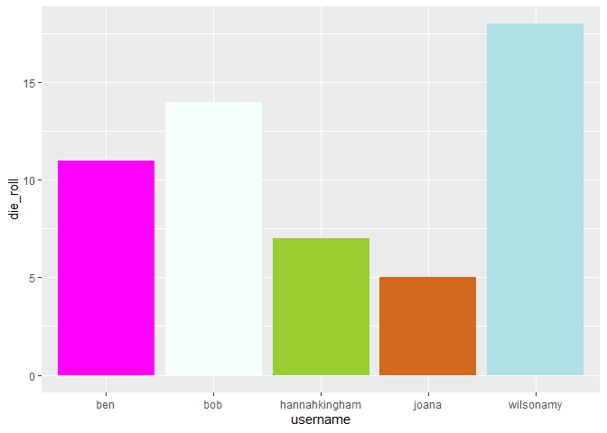
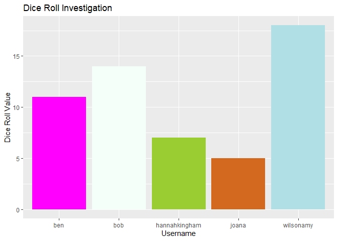
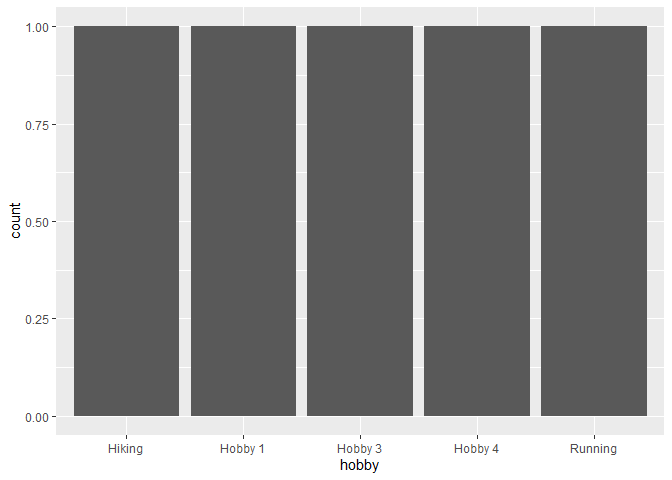

Lab 00 - Hello IDS!
================
INSERT TEAM NAME HERE
2022-09-24

### Load packages and data

``` r
library(tidyverse) 
```

### Exercises 13–17

We set up the data frame.

``` r
usernames <- c("wilsonamy", "joana", "hannahkingham", "bob", "ben") #Extend if necessary
nums <- c(18, 5, 7, 14, 11) #Extend if necessary
colours <- c("powderblue", "chocolate", "yellowgreen", "mintcream", "magenta") #Extend if necessary
hobbies <- c("Hiking", "Hobby 1", "Running", "Hobby 3", "Hobby 4") #Extend if necessary

team_data <- tibble(username = usernames, die_roll = nums, colour = colours,
                    hobby = hobbies)
```

### Exercise 18

We now work on visualising our data.

``` r
# Uncomment the three lines below
 p1 <- ggplot(team_data, aes(x = username, y = die_roll)) +
   geom_col(fill = team_data$colour)
 p1
```

<!-- -->

### Exercise 19

The plot shows the value that each person rolled

### Exercises 20–21

``` r
# Uncomment the three lines below
 p1 +
   labs(x = "Username", y = "Dice Roll Value",
        title = "Dice Roll Investigation")
```

<!-- -->

The plot has custom has axis titles

### Exercise 22

``` r
p2 <- ggplot(team_data, aes(x = hobby)) +
  geom_bar()
p2
```

<!-- -->

Everyone is likely to have different hobbies. Perhaps better to display
data in a table for this
